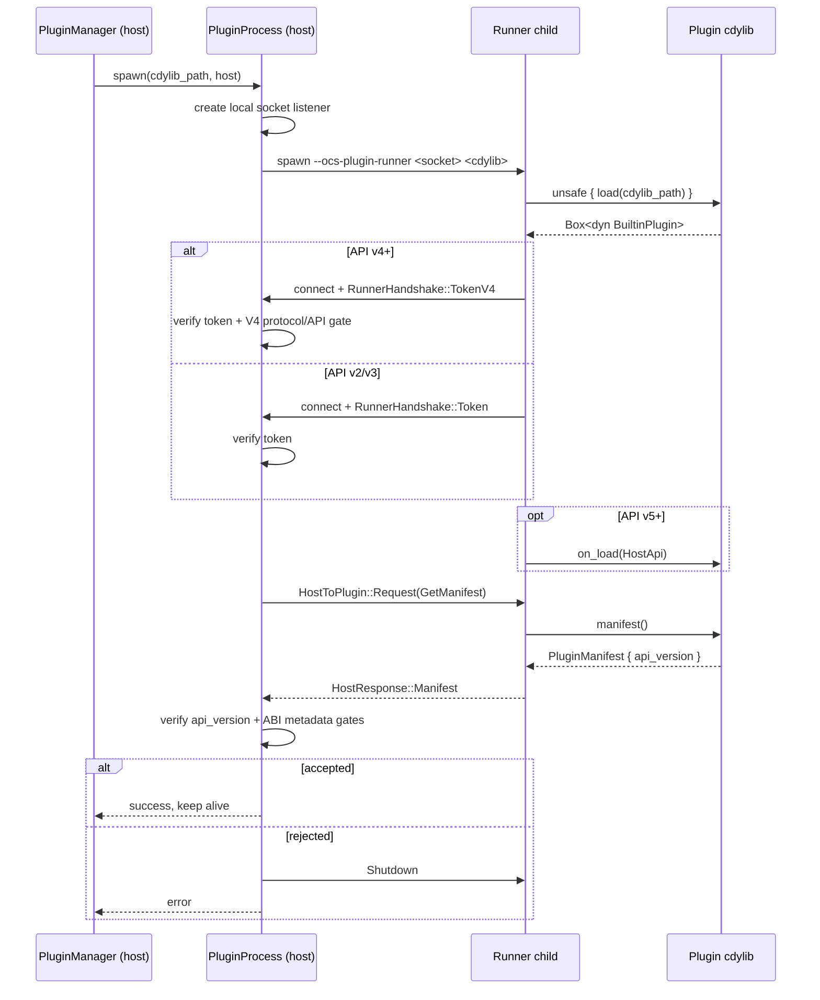
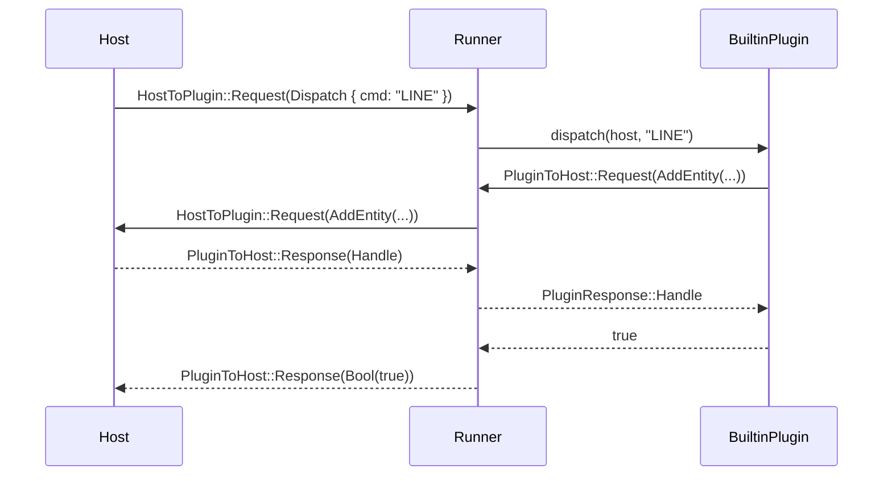
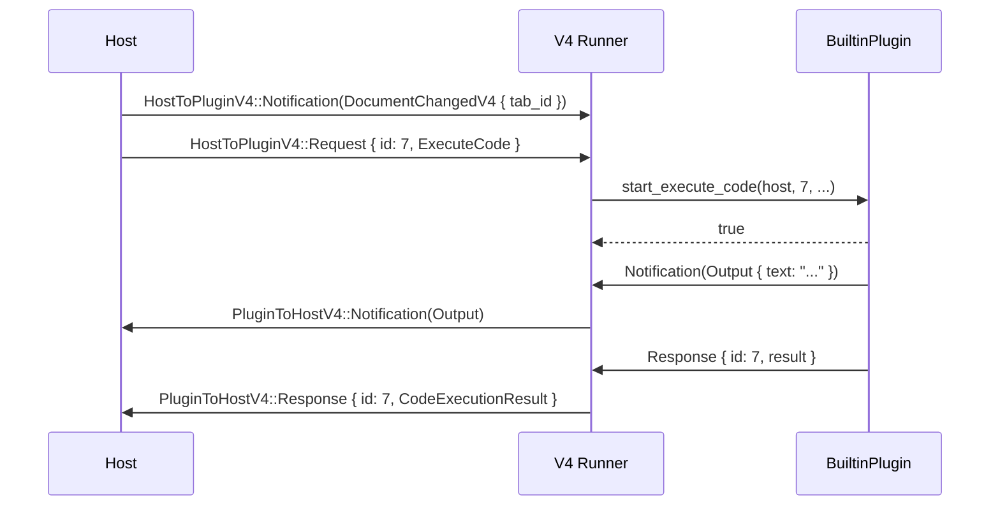
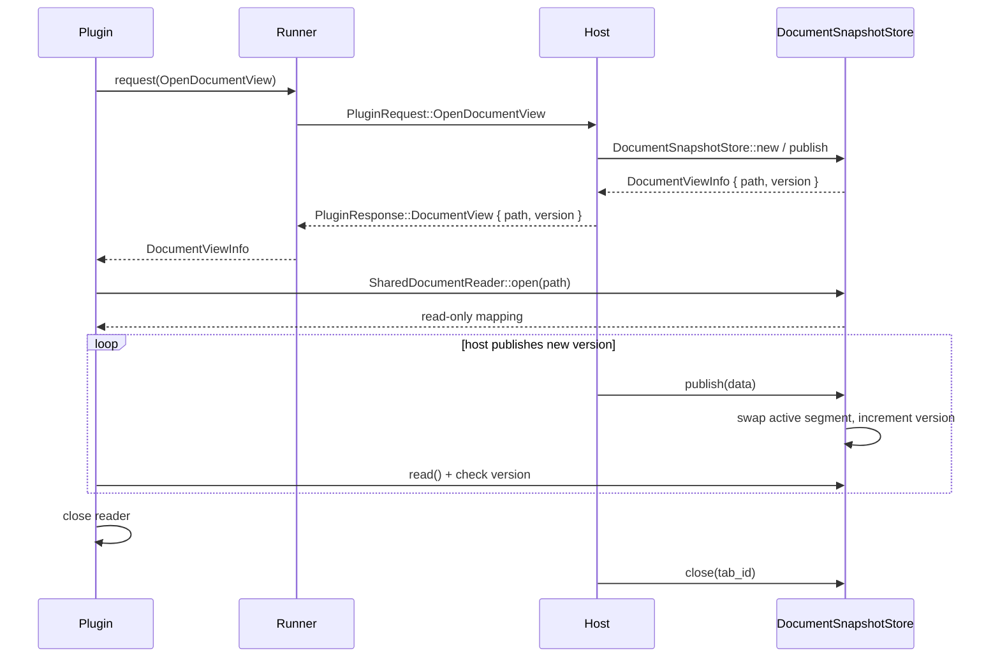

# `ocs_plugin_api` — Internal Architecture

Internal-facing architecture documentation for `crates/ocs_plugin_api`. For plugin-author tutorials see [`README.md`](./README.md); for host/plugin integration design goals see [`../../docs/plugin-architecture.md`](../../docs/plugin-architecture.md).

---

## Overview

`ocs_plugin_api` is the stable, semver-versioned contract between the Open CAD Studio host and add-on plugins. The crate is intentionally split into two tiers:

| Tier | Feature | Dependencies | Purpose |
|------|---------|--------------|---------|
| **Core** | default | none | `PluginManifest`, `ApiVersion`, ribbon vocabulary, type registry, version info. Engine crates and external tooling can depend on this cheaply. |
| **Runtime host surface** | `host` | `acadrust`, `interprocess`, `memmap2`, `rkyv`, etc. | `HostApi`, `BuiltinPlugin`, out-of-process spawn, IPC, shared-memory snapshots, runner. |

The host and each plugin run in separate OS processes. The host re-executes itself in `--ocs-plugin-runner` mode, the runner dynamically loads the plugin `cdylib`, and the two sides talk over a local socket. Process isolation keeps plugin crashes from affecting the host or other plugins.

---

## Module map

| Module | Responsibility |
|--------|----------------|
| [`src/manifest.rs`](src/manifest.rs) | `API_VERSION`, `API_VERSION_MIN_SUPPORTED`, `ApiVersion` compatibility, runtime `OCS_PLUGIN_MAX_API_VERSION` gate. |
| [`src/ribbon`](src/ribbon) | `CadModule` trait and plain-data ribbon types (`RibbonGroup`, `ToolDef`, `IconKind`, `ModuleEvent`). |
| [`src/host.rs`](src/host.rs) | `HostApi` plugin-facing runtime trait, `BuiltinPlugin` entry-point trait, `export_plugin!` macro, `HostNotification`, `PluginNotification`. |
| [`src/ipc/mod.rs`](src/ipc/mod.rs) | IPC layer public exports. |
| [`src/ipc/protocol.rs`](src/ipc/protocol.rs) | V2/V3 request/response enums (`HostRequest`, `HostResponse`, `PluginRequest`, `PluginResponse`), `RunnerHandshake`, `PLUGIN_TOKEN_ENV`. |
| [`src/ipc/transport.rs`](src/ipc/transport.rs) | Length-framed bincode send/recv over `interprocess::local_socket::Stream`. |
| [`src/ipc/client.rs`](src/ipc/client.rs) | Plugin-side V2/V3 `IpcClient` and `PluginHostApi` proxy. |
| [`src/ipc/server.rs`](src/ipc/server.rs) | Host-side handler that applies a `PluginRequest` to a `HostApi` implementation. |
| [`src/ipc/v4`](src/ipc/v4) | Multiplexed V4 protocol: frames, notifications, correlation ids. |
| [`src/ipc/proxy.rs`](src/ipc/proxy.rs) | Optional TCP request proxy for plugin child processes. |
| [`src/process.rs`](src/process.rs) | `PluginProcess` lifecycle: spawn, handshake, call, timeouts, `NullHost`, io draining. |
| [`src/process/manager.rs`](src/process/manager.rs) | `PluginManager`: owns loaded plugins, dispatch routing, notification broadcast, V4 gating. |
| [`src/process/v4.rs`](src/process/v4.rs) | Host-side V4 connection and reader thread. |
| [`src/runner.rs`](src/runner.rs) | Runner entry point and V2/V3 vs V4 request loops; loads cdylib via `libloading`. |
| [`src/shm.rs`](src/shm.rs) | Shared-memory document snapshot layout, `DocumentSnapshotStore`, `SharedDocumentReader`, V3/V4 view data. |
| [`src/host_v4.rs`](src/host_v4.rs) | Host-side per-tab V4 snapshot manager. |
| [`src/type_registry.rs`](src/type_registry.rs) / [`src/type_registry_types.rs`](src/type_registry_types.rs) | Build-time `serde-reflection` registry, embedded JSON, schema types. |
| [`src/version_info.rs`](src/version_info.rs) | Embedded version metadata and acadrust source-compatibility helper. |

---

## Versioning and ABI stability

- `API_VERSION` (currently `5`) is the host's advertised major.
- `API_VERSION_MIN_SUPPORTED` (currently `2`) is the oldest plugin major the host loads.
- `OCS_PLUGIN_MAX_API_VERSION` can cap the accepted major at runtime (e.g. `4` to disable V5).
- A plugin built against major `N` runs on a host whose major is `>= N` because new vtable entries and enum variants are appended at the end.
- V4 introduces the **acadrust gate**: plugins targeting API v4 or later must resolve the same `acadrust` source as the host (see [`src/version_info.rs`](src/version_info.rs)).
- V5 introduces `BuiltinPlugin::on_load` and tab-keyed document paths.

The runtime enforces three gates:

1. `ocs_plugin_api_version()` exported by the cdylib must be within `[API_VERSION_MIN_SUPPORTED, effective_max_api_version()]`.
2. For v4+, `acadrust_sources_compatible(host_acadrust_source(), plugin_acadrust_source)` must be true.
3. For v4+, the plugin must declare `rustc_version`, and `rustc_versions_compatible(host_rustc_version(), plugin_rustc_version)` must be true.

---

## Process model

Key invariants:

- The runner process is the host binary re-executed with special CLI args, so runner and host share the same `ocs_plugin_api` build.
- The plugin cdylib is `dlopen`-ed inside the runner, not the host.
- A pre-shared token (`OCS_PLUGIN_TOKEN`) authenticates the runner to the host.
- `PluginProcess` owns the `Child` handle and a reader thread; `PluginManager` owns the loaded plugins.

---

## Wire protocols

### V2/V3: request/response over a single socket

A single bidirectional socket carries both directions. While the host waits for a response to a `HostRequest`, it may receive nested `PluginRequest`s from the runner and handles them inline.

Compatibility rule: new variants are appended at the end of `HostRequest`, `HostResponse`, `PluginRequest`, and `PluginResponse`, preserving bincode discriminant indices for old plugins.

### V4: multiplexed frames

V4 keeps the V3 request vocabulary but multiplexes requests, responses, and best-effort notifications over one local socket. Every request/response carries a correlation `id`; notifications carry an optional `command_id`.

Key types in [`src/ipc/v4/protocol.rs`](src/ipc/v4/protocol.rs):

- `HostToPluginV4`: `Request { id, HostRequest }`, `Response { id, PluginResponse }`, `Notification<HostNotification>`.
- `PluginToHostV4`: `Request { id, tab_id, PluginRequest }`, `Response { id, HostResponse }`, `Notification<PluginNotification>`.
- `NotificationEnvelope<T>`: `{ command_id: Option<u64>, payload: T }`.

Notifications are best-effort: per-process errors are logged, not propagated. Unknown host-notification discriminants deserialize to `HostNotification::Unknown(raw)` so a newer host does not crash an older plugin.

---

## Shared-memory document views

V3 and V4 avoid cloning the full `CadDocument` over IPC for large reads. The host owns a memory-mapped file; the plugin maps it read-only.

- [`src/shm.rs`](src/shm.rs) defines the generic double-buffered control page and the `SnapshotData` trait. Implementations live in the same file for V3 (`DocumentViewData`) and V4 (`DocumentViewDataV4`).
- [`src/host_v4.rs`](src/host_v4.rs) keeps a global `HostV4SnapshotManager` keyed by `tab_id`, so each document tab has its own snapshot.
- Segment size defaults to 16 MiB and is configurable via `OCS_V4_SNAPSHOT_SEGMENT_SIZE` (minimum 1 MiB).

---

## Notifications

- **Host → plugin:** `HostNotification` in [`src/host.rs`](src/host.rs). V4-only delivery via `PluginManager::broadcast_notification`. Currently emitted examples: `DocumentChangedV4`, `SelectionChangedV4`, `DocumentTabClosed`.
- **Plugin → host:** `PluginNotification` in [`src/host.rs`](src/host.rs). Examples: `Output`, `Progress`, `Log`. Handler installed via `PluginManager::set_notification_handler`.

Broadcasting is V4-gated inside `PluginManager::broadcast_notification`: V2/V3 processes are skipped. The handler runs on the V4 reader thread and must not block.

---

## Error handling and timeouts

| Kind | Default | Env var | Behavior |
|------|---------|---------|----------|
| Spawn / connect timeout | 30 s | `OCS_PLUGIN_SPAWN_TIMEOUT_SECS` | Host aborts spawn, plugin is not loaded. |
| Per-call timeout | 30 s | `OCS_PLUGIN_CALL_TIMEOUT_SECS` | Host kills runner, plugin marked dead. Floor timeouts apply to `GetManifest`/`GetRibbon`, `Dispatch`, and interactive events. |
| Oversized message | — | — | Transport rejects messages > 64 MiB with `TransportError::TooLarge`. |
| Malformed message | — | — | `bincode` deserialize error; V4 reader logs and continues if possible. |
| Panic in plugin code | — | — | Caught by `catch_unwind` in the runner; converted to `HostResponse::Error`. |
| Dead runner | — | — | Detected via `try_wait` on next dispatch or ribbon rebuild; plugin dropped. |

---

## Embedded metadata

The crate embeds two JSON blobs at build time:

- **Type registry** (`OUT_DIR/type_registry.json`) — a language-binding-friendly schema for every editor record root and its dependent types, generated by `serde-reflection` in `build.rs`. See [`src/type_registry.rs`](src/type_registry.rs).
- **Version info** (`OUT_DIR/version_info.json`) — host version, `ocs_plugin_api` version, `acadrust` version and source, `rustc` version, API versions, build timestamp. See [`src/version_info.rs`](src/version_info.rs).

Both are accessible without enabling the `host` feature.

---

## Security / isolation boundaries

- **Process isolation:** plugin code runs in a child process.
- **Token handshake:** `OCS_PLUGIN_TOKEN` is generated per spawn and checked before accepting the runner connection.
- **C-ABI export:** plugins expose only two symbols, `ocs_plugin_api_version` and `ocs_plugin_register`, defined by `export_plugin!`.
- **Message size cap:** 64 MiB per length-framed message.
- **Shared memory:** plugin maps snapshots read-only; the host controls publish/close.

This is defense-in-depth, not a sandbox: plugins execute native code.

---

## Failure modes

| Scenario | Result |
|----------|--------|
| Plugin panics during dispatch | Runner catches, returns error response, process stays alive. |
| Call timeout | Host kills runner, plugin marked dead. |
| Spawn timeout or crash | Spawn fails; plugin not loaded; error surfaced in UI/logs. |
| Version mismatch | Host refuses plugin before running plugin code. |
| Acadrust source mismatch (v4+) | Host refuses plugin to avoid binary incompatibilities. |
| Rustc mismatch (v4+) | Host refuses plugin to avoid cross-compiler ABI crashes. |
| Unknown notification discriminant | Deserializes to `HostNotification::Unknown`; plugin can ignore. |

---

## Open tasks

- **Reduce broadcast notification clone/serialize overhead.** `PluginManager::broadcast_notification` clones the `HostNotification` (including its `Vec<Handle>`) once per loaded V4 plugin, and `transport::send` re-serializes the payload into a new `Vec<u8>` per plugin. Fixing this properly requires either a public API change (`Arc<Vec<Handle>>` in `HostNotification`) or a new bytes-oriented broadcast path in the IPC layer. It only matters with many plugins plus very large selections.

---

## Cross-references

- Plugin-author quick start: [`README.md`](./README.md)
- Host/plugin integration spec: [`../../docs/plugin-architecture.md`](../../docs/plugin-architecture.md)
- Plugin template: [`../../docs/plugin-template/`](../../docs/plugin-template/)
- Process spawn: [`src/process.rs`](src/process.rs)
- Process manager: [`src/process/manager.rs`](src/process/manager.rs)
- Runner loop: [`src/runner.rs`](src/runner.rs)
- V4 protocol: [`src/ipc/v4/protocol.rs`](src/ipc/v4/protocol.rs)
- Shared memory: [`src/shm.rs`](src/shm.rs)
