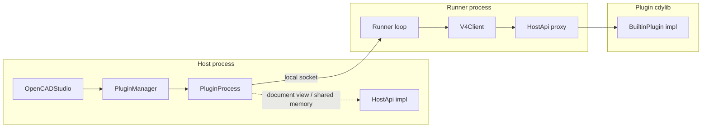
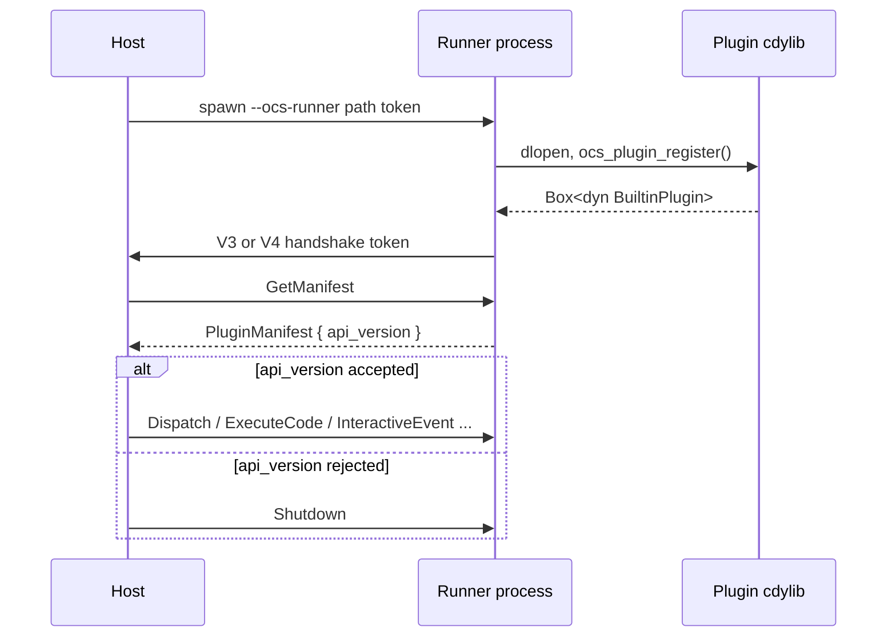
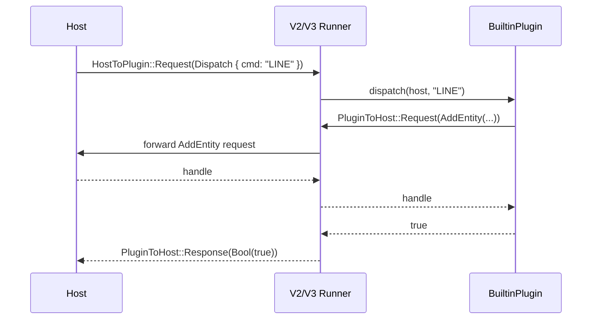
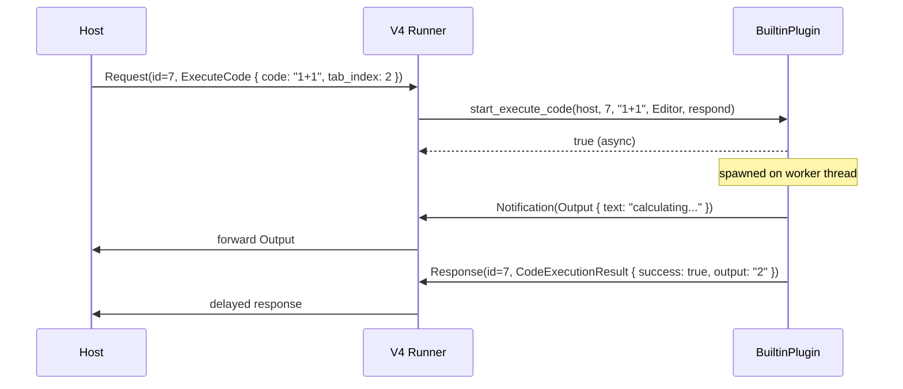

# `ocs_plugin_api`

Versioned, out-of-process plugin API for Open CAD Studio. This crate defines the
contract between the host CAD application and third-party plugins. It is
designed to stay small and dependency-free in its default configuration so that
plugin crates and external tooling can depend on the manifest/ribbon surface
cheaply. The runtime host surface is enabled by the `host` feature.

## Plugin Architecture

OCS is scriptable and extensible through a versioned plugin API. The API
supports four major generations: **V2**, **V3**, **V4**, and **V5**. Each
generation keeps the previous ABI stable by appending new vtable entries and new
enum variants at the end, so older plugins continue to load on newer hosts.

| Version | Delivery model | Key capability | ABI / wire change |
|---------|----------------|----------------|-------------------|
| **V2** | Out-of-process runner | Synchronous commands + interactive point collection (`HostApi::start_interactive`) | Baseline |
| **V3** | Out-of-process runner | Local cached `document()`/`document_mut()` + shared-memory `DocumentReader`/`document_view` for large reads | New vtable entries appended; new `PluginRequest`/`PluginResponse` variants appended |
| **V4** | Out-of-process runner over a multiplexed local socket | Full-duplex notifications + asynchronous REPL `ExecuteCode` | New `HostToPluginV4`/`PluginToHostV4` frame layer; `BuiltinPlugin::on_notification` and `start_execute_code` appended to trait |
| **V5** | V4 multiplexed runner | One-shot initialization + tab-keyed document paths | `BuiltinPlugin::on_load` and `HostApi::document_path` appended to the traits |

The host controls which generations are accepted at runtime through
`OCS_PLUGIN_MAX_API_VERSION` (e.g. `2` for V2-only mode, `4` to disable V5). The
current host advertises [`API_VERSION = 5`](src/manifest.rs) and supports plugins
back to `API_VERSION_MIN_SUPPORTED = 2`.

V5 calls `BuiltinPlugin::on_load` once after the runner connects and before the
first user command. Plugins can cache `HostApi::plugin_request_sender()` there
for worker-thread access. A panic in the callback fails plugin loading.
`HostApi::document_path(tab_id)` returns the saved path for a document tab.

### High-level layout



A plugin is a Rust `cdylib` (or any language exposing the C symbols) that:

1. Exports `ocs_plugin_api_version()` — returns the API major the plugin was
   built against.
2. Exports `ocs_plugin_register()` — returns a `Box<dyn BuiltinPlugin>`.
3. Implements `BuiltinPlugin` (manifest, ribbon, dispatch, optional REPL
   execution, optional notifications).

The host does **not** load the plugin into its own address space. It re-executes
itself as `--ocs-runner <cdylib-path> <token>` and talks to the runner over a
local socket. This isolates plugin crashes from the CAD process.

### Version handshake



### V2/V3 wire protocol

V2 and V3 share the same request/response framing. The host sends a
`HostToPlugin::Request(HostRequest::*)`; the runner executes it and returns a
`PluginToHost::Response(HostResponse::*)`. Nested plugin-to-host requests (for
example `add_entity`) are allowed inside a dispatch: the runner creates a
temporary `HostApi` proxy, forwards the `PluginRequest`, awaits the host reply,
and resumes the original call.



### V4 wire protocol

V4 replaces the simple request/response pipe with a multiplexed local socket.
The frame format supports:

- Host → runner requests (`HostToPluginV4::Request { id, payload: HostRequest }`)
- Runner → host responses (`PluginToHostV4::Response { id, payload: HostResponse }`)
- Bi-directional, best-effort notifications (`NotificationEnvelope`)

Because the socket is full-duplex, the host can push
`HostNotification::DocumentChangedV4`, `SelectionChangedV4`, or
`DocumentTabClosed` to a plugin at any time, and the plugin can stream
`PluginNotification::Output`/`Progress`/`Log` back while a long command is still
running.



### V4 asynchronous REPL execution

V4 introduces `BuiltinPlugin::start_execute_code`. It is the plugin's entry point
for REPL-style code evaluation. The signature receives the active tab's
`HostApi` so the REPL session is tied to the document tab that invoked it, plus a
`respond` callback that the plugin calls when evaluation finishes (possibly from a
background thread).

V4 also introduces `PluginRequestSender`: a thread-safe, `'static` interface that
lets a plugin send `PluginRequest`s back to the host from any thread. This is
useful when the plugin spawns a background worker (for example, the Python REPL's
mutation thread) that needs to read the document snapshot or apply mutations
without blocking the runner loop. Obtain it from `HostApi::plugin_request_sender()`;
it is only available when the plugin is hosted out-of-process by a V4 runner.

```rust
use ocs_plugin_api::host::{
    BuiltinPlugin, CommandSource, ExecutionResult, HostApi, execute_code_guard,
    PluginRequestSender,
};
use ocs_plugin_api::ipc::protocol::{PluginRequest, PluginResponse};

struct ReplPlugin;

impl BuiltinPlugin for ReplPlugin {
    // ... manifest, ribbon, dispatch ...

    fn start_execute_code(
        &mut self,
        host: &mut dyn HostApi,
        _command_id: u64,
        code: &str,
        _source: CommandSource,
        respond: Box<dyn FnOnce(ExecutionResult) + Send>,
    ) -> bool {
        let tab = host.tab_index();
        let code = code.to_string();

        // A V4 host can provide a sender for background threads.
        let sender: Option<Arc<dyn PluginRequestSender>> = host.plugin_request_sender().map(Arc::from);

        execute_code_guard(respond, move || {
            // Long-running evaluation happens here without blocking the runner loop.
            // If a sender is available, worker threads can use it to call back into
            // the host, e.g. to refresh the document snapshot.
            let result = evaluate(&code, tab, sender.as_deref());
            ExecutionResult {
                success: result.is_ok(),
                output: result.ok(),
                error: result.err(),
                error_type: None,
                traceback: None,
                line_number: None,
                column_number: None,
                duration_ms: 0.0,
            }
        });
        true
    }
}
```

```rust
// Used from a background thread.
fn refresh_snapshot(sender: &dyn PluginRequestSender) -> Result<String, Box<dyn Error>> {
    match sender.request(PluginRequest::OpenDocumentView)? {
        PluginResponse::DocumentView { path, version } => Ok(path),
        other => Err(format!("unexpected response: {other:?}").into()),
    }
}
```

The host side calls it synchronously but with a long timeout:

```rust
use ocs_plugin_api::host::CommandSource;
use ocs_plugin_api::process::{PluginError, PluginProcess};

fn run_editor_snippet(
    plugin: &PluginProcess,
    host: &mut dyn HostApi,
) -> Result<String, PluginError> {
    let result = plugin.execute_code(host, 42, CommandSource::Editor, "1+1")?;
    Ok(result.output.unwrap_or_default())
}
```

`PluginProcess::execute_code` reads `host.tab_index()` and forwards it in the
`ExecuteCode` request, so the plugin always knows which document tab the REPL
session belongs to.

### Embedded build-time metadata

`ocs_plugin_api` embeds two JSON blobs at build time:

- **Type registry** — a stable, language-binding-friendly schema generated by
  tracing every editor record root and its dependent types with `serde-reflection`.
- **Version info** — `ocs_version`, `ocs_plugin_api_version`, `acadrust_version`,
  `api_version`, etc.

Access them without pulling the `host` feature:

```rust
let registry_json = ocs_plugin_api::get_embedded_type_registry_json();
let version_json = ocs_plugin_api::get_embedded_version_info_json();
```

### Minimal plugin example

```rust
use ocs_plugin_api::export_plugin;
use ocs_plugin_api::host::{BuiltinPlugin, HostApi, PluginManifest};
use ocs_plugin_api::manifest::ApiVersion;
use ocs_plugin_api::ribbon::{
    CadModule, IconKind, ModuleEvent, RibbonGroup, RibbonItem, ToolDef,
};

static MANIFEST: PluginManifest = PluginManifest {
    id: "com.example.hello",
    name: "Hello Plugin",
    version: "0.1.0",
    description: "A minimal example plugin.",
    api_version: ApiVersion::CURRENT,
    ribbon_order: 100,
    xdata_apps: &[],
    command_prefixes: &["HELLO"],
};

struct HelloModule;
impl CadModule for HelloModule {
    fn id(&self) -> &'static str { MANIFEST.id }
    fn title(&self) -> &'static str { "Hello" }
    fn ribbon_groups(&self) -> &[RibbonGroup] {
        static GROUPS: &[RibbonGroup] = &[RibbonGroup {
            title: "Example",
            tools: vec![RibbonItem::Tool(ToolDef {
                id: "HELLO",
                label: "Say Hello",
                icon: IconKind::Glyph("H"),
                event: ModuleEvent::Command("HELLO".to_string()),
            })],
        }];
        GROUPS
    }
}

struct HelloPlugin;
impl BuiltinPlugin for HelloPlugin {
    fn manifest(&self) -> &'static PluginManifest { &MANIFEST }
    fn ribbon(&self) -> Box<dyn CadModule> { Box::new(HelloModule) }
    fn dispatch(&self, host: &mut dyn HostApi, cmd: &str) -> bool {
        if cmd == "HELLO" {
            host.push_info("Hello from the plugin!");
            return true;
        }
        false
    }
}

export_plugin!(HelloPlugin);
```

### Host-side loading example

```rust
use std::path::Path;
use std::sync::Arc;
use ocs_plugin_api::process::{PluginError, PluginManager};

fn main() -> Result<(), PluginError> {
    let mut manager = PluginManager::new();
    manager.set_notification_handler(Arc::new(|_id, _cmd, _notif| {}));

    let mut host_api = /* host-provided HostApi implementation */;
    let _plugin_id = manager.load(
        Path::new("./target/release/libhello_plugin.dll"),
        &mut host_api,
    )?;

    let result = manager.dispatch(&mut host_api, "HELLO", |_| false);
    if result.handled {
        println!("Plugin handled HELLO");
    }

    Ok(())
}
```

### V4 shared-memory document view example

V4 plugins can request a zero-copy snapshot of the active document and mutate it
from a background thread through `PluginRequestSender`.

```rust
use std::sync::Arc;
use ocs_plugin_api::host::{BuiltinPlugin, HostApi, PluginRequestSender};
use ocs_plugin_api::ipc::protocol::{PluginRequest, PluginResponse};
use ocs_plugin_api::shm::DocumentViewDataV4;
use ocs_plugin_api::shm::SharedDocumentReader;

struct SnapshotWorker {
    reader: SharedDocumentReader<DocumentViewDataV4>,
    sender: Arc<dyn PluginRequestSender>,
}

impl SnapshotWorker {
    fn add_point(&self, x: f64, y: f64, z: f64) -> anyhow::Result<u64> {
        use acadrust::entities::Point;
        use acadrust::EntityType;

        let mut p = Point::from_coords(x, y, z);
        p.common.layer = "0".to_string();
        let entity = EntityType::Point(p);

        match self.sender.request(PluginRequest::AddEntity(entity))? {
            PluginResponse::Handle(h) => Ok(h.value()),
            other => Err(anyhow::anyhow!("unexpected add response: {other:?}")),
        }
    }
}
```

In the `BuiltinPlugin` dispatch method:

```rust
fn dispatch(&self, host: &mut dyn HostApi, cmd: &str) -> bool {
    if cmd != "SNAPSHOT_DEMO" {
        return false;
    }

    let Some(view) = host.document_view_v4(host.tab_id()) else {
        host.push_error("host does not support V4 document views");
        return true;
    };

    let Some(sender) = host.plugin_request_sender() else {
        host.push_error("host does not provide a V4 request sender");
        return true;
    };

    let reader = SharedDocumentReader::<DocumentViewDataV4>::open(Path::new(&view.path))
        .expect("open snapshot");
    let worker = SnapshotWorker {
        reader,
        sender: Arc::from(sender),
    };

    std::thread::spawn(move || {
        let _ = worker.add_point(10.0, 20.0, 0.0);
    });
    true
}
```

### V4 request proxy pattern

When a plugin spawns a child process (for example a Python REPL) that needs to
mutate the host document, the plugin can run a local TCP request proxy and pass
the port to the child. The child connects to the proxy; the proxy forwards
`PluginRequest` frames to the host's `PluginRequestSender` and returns the
responses.

```rust
use std::net::TcpListener;
use ocs_plugin_api::ipc::proxy::run_request_proxy_with_shutdown;

let listener = TcpListener::bind(("127.0.0.1", 0)).unwrap();
let port = listener.local_addr().unwrap().port();

let sender: Arc<dyn PluginRequestSender> = Arc::from(host.plugin_request_sender().unwrap());
std::thread::spawn(move || {
    let (shutdown_tx, shutdown_rx) = std::sync::mpsc::channel::<()>();
    run_request_proxy_with_shutdown(listener, sender, shutdown_rx).ok();
});

// Pass `port` to the child process via environment variable.
```

### Further reading

- Internal architecture & invariants: [`ARCHITECTURE.md`](./ARCHITECTURE.md)
- Host/plugin integration spec: [`../../docs/plugin-architecture.md`](../../docs/plugin-architecture.md)
- Plugin template: [`../../docs/plugin-template`](../../docs/plugin-template)
- Plugin marketplace registry: [`../../plugins/README.md`](../../plugins/README.md)
- REPL design notes: [`../DESIGN_REPL.md`](../DESIGN_REPL.md)
