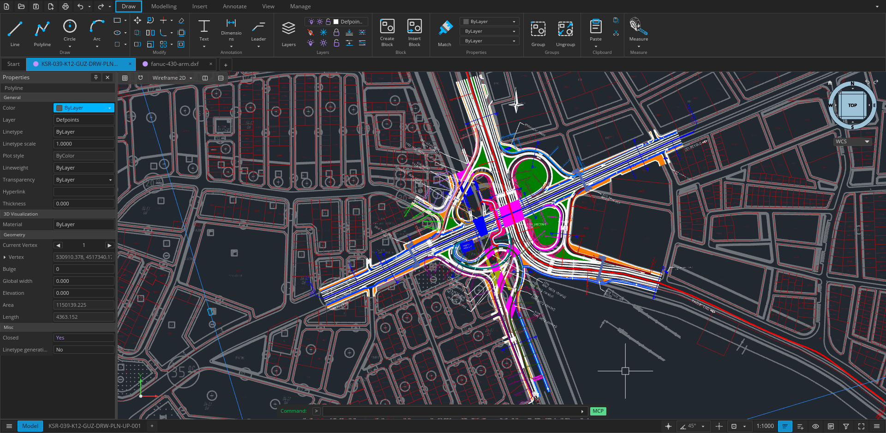
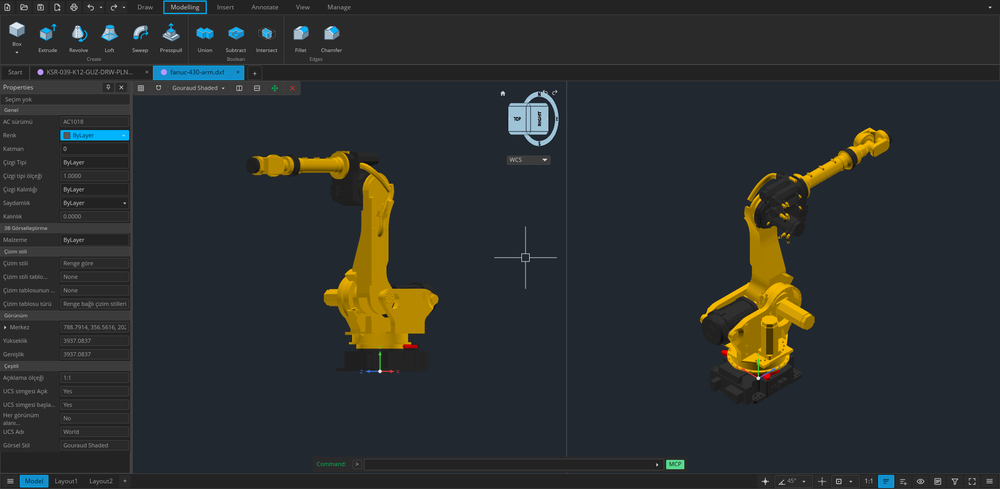

<p align="center">
  <a href="../../README.md">English</a> · <a href="README.bg.md">Български</a> · <a href="README.pt-BR.md">Português (Brasil)</a> · <a href="README.cs.md">Čeština</a> · <a href="README.nl.md">Nederlands</a> · <a href="README.fr.md">Français</a> · <a href="README.fi.md">Suomi</a> · <a href="README.de.md">Deutsch</a> · <a href="README.el.md">Ελληνικά</a> · <a href="README.hu.md">Magyar</a> · <a href="README.it.md">Italiano</a> · <a href="README.ja.md">日本語</a> · <a href="README.ko.md">한국어</a> · <a href="README.pl.md">Polski</a> · <a href="README.ru.md">Русский</a> · <a href="README.zh-CN.md">简体中文</a> · <a href="README.es.md">Español</a> · <a href="README.zh-TW.md">繁體中文</a> · <a href="README.tr.md">Türkçe</a> · <a href="README.hi.md">हिन्दी</a> · <a href="README.ar.md">العربية</a>
</p>

<p align="center"></p>
<h1 align="center">Open CAD Studio</h1>
<p align="center">Disegno 2D e modellazione 3D open source per desktop e web, sviluppati in Rust.</p>

<p align="center">
  <a href="https://github.com/HakanSeven12/OpenCADStudio/releases/latest"></a>
  <a href="https://github.com/HakanSeven12/OpenCADStudio/releases"></a>
  <a href="https://github.com/HakanSeven12/OpenCADStudio/stargazers"></a>
  <a href="../../LICENSE"></a>
</p>

<p align="center">
  <a href="https://www.opencadstudio.com"><strong>Avvia l’app web</strong></a> ·
  <a href="https://github.com/HakanSeven12/OpenCADStudio/releases/latest"><strong>Scarica l’app desktop</strong></a> ·
  <a href="https://github.com/HakanSeven12/OpenCADStudio/discussions"><strong>Partecipa alla discussione</strong></a>
</p>

<p align="center"></p>

## Panoramica

Open CAD Studio è un’applicazione multipiattaforma per disegno tecnico, impaginazione e modellazione solida. Legge e scrive nativamente disegni DWG e DXF, usando lo stesso nucleo di modifica nelle versioni desktop e browser.

Il progetto è in sviluppo attivo. Conserva copie di sicurezza dei disegni di produzione importanti e segnala i problemi riproducibili tramite [GitHub Issues](https://github.com/HakanSeven12/OpenCADStudio/issues).

## Funzionalità principali

- **Flusso di disegno nativo** — apri, modifica, recupera e salva file DWG e DXF senza servizi di conversione.
- **Disegno 2D preciso** — linee, polilinee, curve, spline, tratteggi, snap a oggetto, tracciamento, layer, blocchi e riferimenti esterni.
- **Strumenti di documentazione** — testo, quote, direttrici, tolleranze, tabelle, spazio modello, spazio carta, finestre e stili di stampa.
- **Modellazione 3D basata su kernel** — primitive solide, estrusione, rivoluzione, sweep, loft, operazioni booleane e tassellazione di entità ACIS.
- **Rendering GPU** — viste 2D e 3D accelerate tramite `wgpu`, con telecamere ortografiche e prospettiche.
- **Flussi estensibili** — plugin nativi, script di comandi, conversione headless e API di automazione JSON basata su righe.

<p align="center"></p>

## Flussi dei file

| Formato o flusso | Supporto |
| --- | --- |
| DWG | Lettura e scrittura; destinazioni di salvataggio versionate da R14 a 2018 |
| DXF | Lettura e scrittura; destinazioni di salvataggio versionate da R14 a 2018 |
| BAK / SV$ | Apertura di backup e file di salvataggio automatico |
| OBJ | Importazione di mesh poligonali |
| LandXML | Importazione di punti di rilievo `CgPoint` |
| STL | Esportazione di dati mesh 3D |
| STEP AP203 | Esportazione di dati mesh 3D |
| PDF | Stampa di layout e geometria selezionata sul desktop |
| CSV | Estrazione dei dati delle proprietà delle entità |
| CTB / STB | Caricamento e modifica delle tabelle degli stili di stampa |

## Desktop o web

Usa l’[app web](https://www.opencadstudio.com) per l’accesso immediato senza installazione. I disegni vengono selezionati nel browser e salvati come download locali.

Usa l’applicazione desktop per associazioni file native, anteprime nel gestore file, stampa di sistema, output PDF, plugin esterni, script di comandi e automazione headless. Sono disponibili build per Windows, Linux e macOS Apple Silicon.

## Installazione

Scarica tutti i pacchetti aggiornati dall’[ultima versione](https://github.com/HakanSeven12/OpenCADStudio/releases/latest).

### Windows

Scegli uno di questi pacchetti x86-64 firmati:

- `OpenCADStudio-*-windows-x86_64-installer.msi` — programma di installazione consigliato con collegamenti nel menu Start, associazioni DWG/DXF e anteprime dei disegni.
- `OpenCADStudio-*-windows-x86_64-portable.exe` — applicazione autonoma, senza installazione.

### Linux

Scarica l’AppImage x86-64, rendila eseguibile e avviala:

```bash
chmod +x OpenCADStudio-*-linux-x86_64.AppImage
./OpenCADStudio-*-linux-x86_64.AppImage
```

### macOS

Il pacchetto macOS pubblicato supporta Apple Silicon:

1. Scarica `OpenCADStudio-*-macos-arm64.dmg`.
2. Apri l’immagine e trascina `OpenCADStudio.app` in **Applications**.
3. Se Gatekeeper blocca il primo avvio, autorizza l’app da **System Settings → Privacy & Security**.

L’applicazione è firmata ad hoc, ma attualmente non è autenticata da Apple.

## Lingue

Open CAD Studio può seguire la lingua di sistema o usare una di queste 21 lingue dell’interfaccia:

> Arabo · Portoghese brasiliano · Bulgaro · Ceco · Olandese · Inglese · Finlandese · Francese · Tedesco · Greco · Hindi · Ungherese · Italiano · Giapponese · Coreano · Polacco · Russo · Cinese semplificato · Spagnolo · Cinese tradizionale · Turco

Cambia la lingua nelle impostazioni dell’applicazione. La versione browser usa anche la lingua preferita del browser quando è selezionato **Sistema**.

## Compilazione dal sorgente

### Desktop

Requisiti:

- Git
- Toolchain Rust stabile corrente
- Librerie di sviluppo grafiche e dei font della piattaforma

Su Ubuntu o Debian installa le dipendenze native:

```bash
sudo apt update
sudo apt install libgl1-mesa-dev libx11-dev libxcursor-dev libxi-dev \
  libxrandr-dev libxkbcommon-dev libwayland-dev libfontconfig1-dev \
  libfreetype6-dev
```

Poi compila:

```bash
git clone https://github.com/HakanSeven12/OpenCADStudio.git
cd OpenCADStudio
cargo build --release --bin OpenCADStudio
```

Il binario viene scritto in `target/release/OpenCADStudio` (`OpenCADStudio.exe` su Windows).

### Web

Installa una volta il target WebAssembly e gli strumenti di compilazione:

```bash
rustup target add wasm32-unknown-unknown
cargo install trunk wasm-bindgen-cli
```

Avvia il server di sviluppo:

```bash
trunk serve
```

## Automazione

Il binario desktop supporta conversioni singole e un server headless persistente:

```bash
OpenCADStudio --export input.dwg output.dxf
OpenCADStudio --serve
OpenCADStudio --serve --port 4242
OpenCADStudio --mcp
```

Il server scambia un oggetto JSON per riga tramite ingresso/uscita standard o un socket TCP locale. Consulta la [guida all’automazione](../automation/README.md).

## Plugin

I plugin desktop vengono eseguiti in processi separati e comunicano con l’host tramite l’API dei plugin versionata. La build per browser non carica plugin nativi.

- [Architettura dei plugin](../plugin-architecture.md)
- [Modello di plugin](../plugin-template/README.md)
- [Registro dei plugin](../../plugins/README.md)

## Documentazione del progetto

- [API di automazione](../automation/README.md)
- [Architettura dei plugin](../plugin-architecture.md)
- [Pipeline di tassellazione](../tessellation.md)
- [Politica di sicurezza](../../SECURITY.md)

## Contribuire

Segnalazioni di bug, pull request mirate, traduzioni, miglioramenti alla documentazione e contributi ai plugin sono benvenuti.

- Cerca nelle [issue](https://github.com/HakanSeven12/OpenCADStudio/issues) esistenti prima di aprire una nuova segnalazione.
- Usa [Discussions](https://github.com/HakanSeven12/OpenCADStudio/discussions) per domande e idee.
- Segnala le vulnerabilità privatamente seguendo la [politica di sicurezza](../../SECURITY.md).

## Crescita del progetto

<a href="https://github.com/HakanSeven12/OpenCADStudio/stargazers">
  <picture>
    <source media="(prefers-color-scheme: dark)" srcset="https://www.opencadstudio.com/star-history-dark.svg">
    <source media="(prefers-color-scheme: light)" srcset="https://www.opencadstudio.com/star-history-light.svg">
    
  </picture>
</a>

## Sostieni il progetto

Se Open CAD Studio ti aiuta nel lavoro, sostieni lo sviluppo tramite [GitHub Sponsors](https://github.com/sponsors/HakanSeven12) o [Patreon](https://www.patreon.com/HakanSeven12).

## Licenza

Open CAD Studio è distribuito con la [GNU General Public License v3.0](../../LICENSE).
